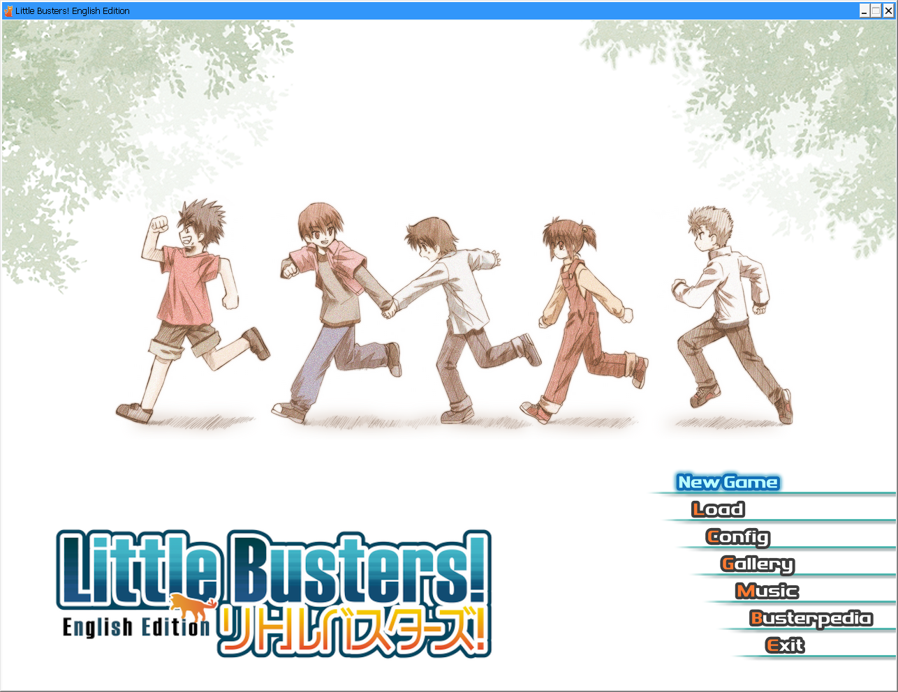
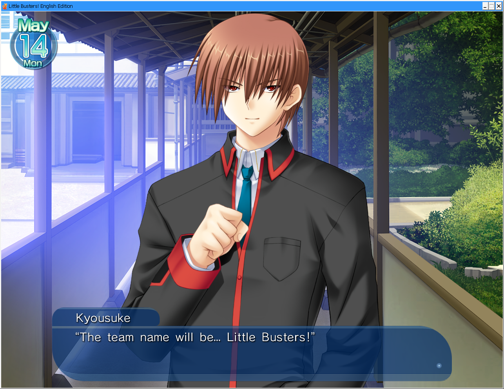
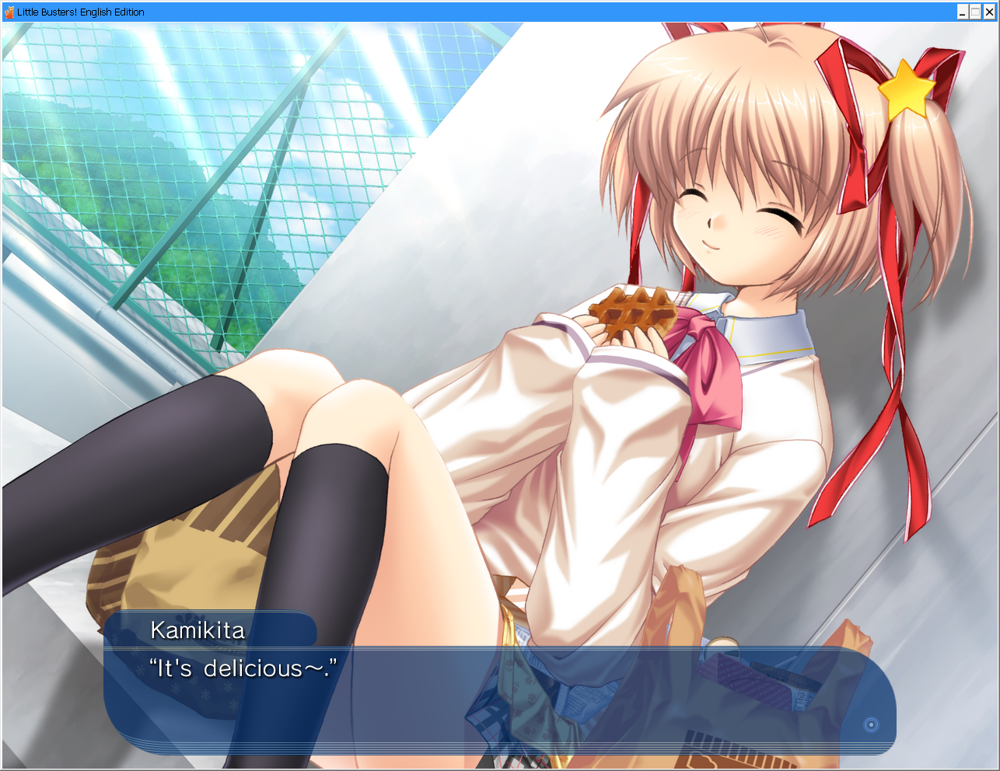
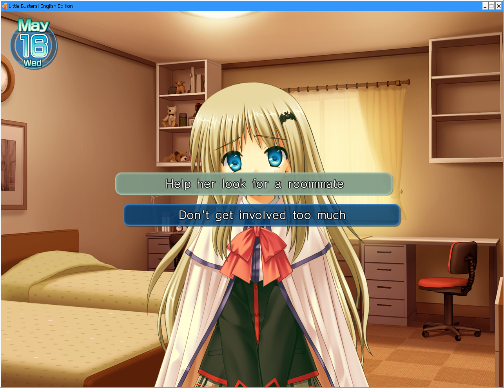
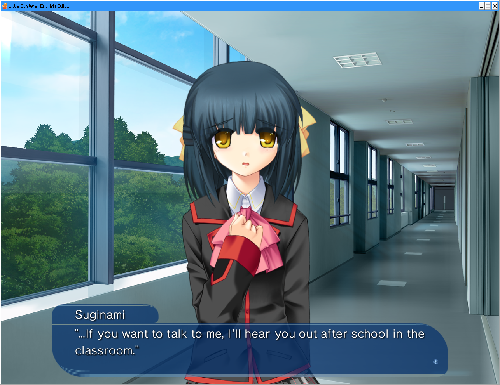
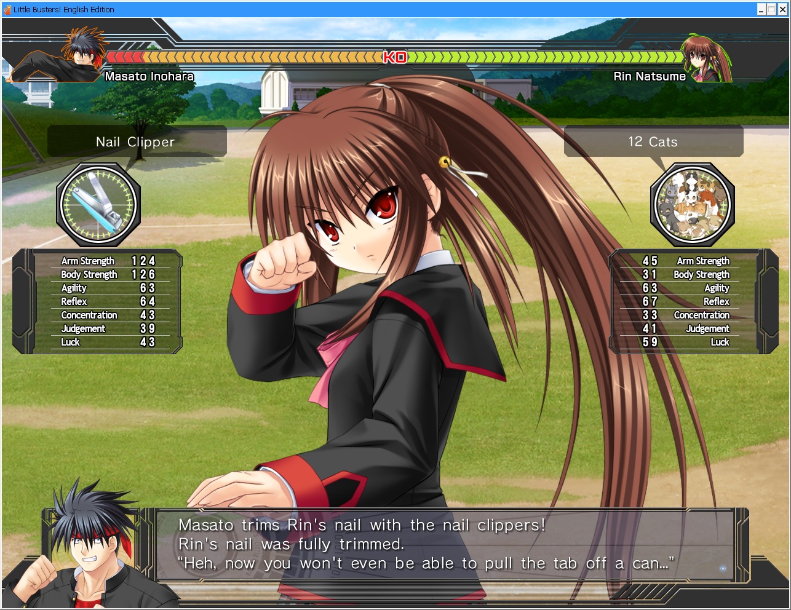
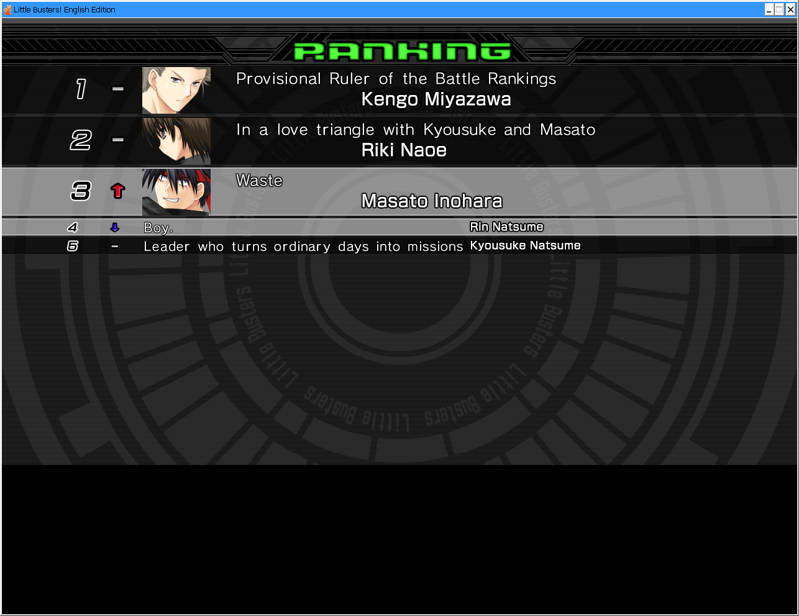
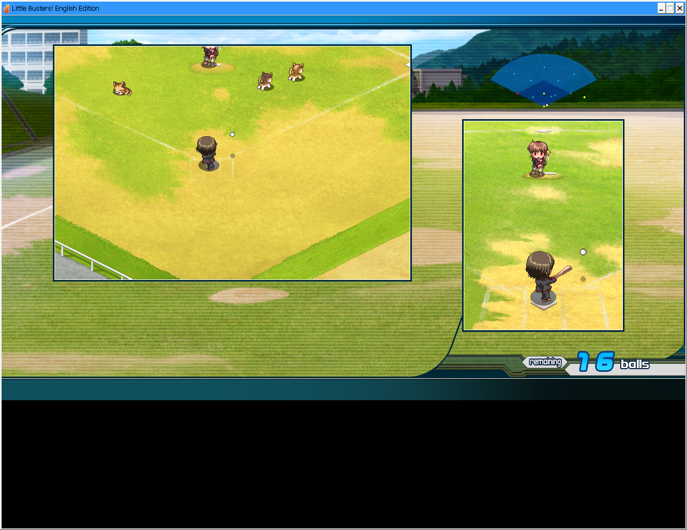

# LBEE Restoration Patch

Restore Little Busters' original assets!

This patch is aimed at the Steam version of Little Busters: English Edition, a port created by Prototype using the Luca Engine. These ports are notorious for having a bland UI and cut backgrounds/CGs due to the 16:9 aspect ratio. Well, that is no longer the case. With this patch...

- The game window and assets are restored to 4:3
- The UI is revamped to mimic the original
- Some CGs are uncensored like the original (optional)
- Added in fan sprites for Suginami (optional)
- The original OP is back! (set movie quality to low under system in game settings)

Do note that the patch is uncensored by default to the levels of the original VN, not of Ecstasy. Also, some elements could not be restored to 4:3, specifically the battle and baseball minigames. We are actively working to get them fixed! 

## Screenshots

<p align="center">
  <a href="https://raw.githubusercontent.com/Danar435/lbee-restoration/refs/heads/main/assets/screenshot-1.png">
    
  </a>
  <a href="https://raw.githubusercontent.com/Danar435/lbee-restoration/refs/heads/main/assets/screenshot-2.png">
    
  </a>
  <a href="https://raw.githubusercontent.com/Danar435/lbee-restoration/refs/heads/main/assets/screenshot-3.png">
    
  </a>
  <a href="https://raw.githubusercontent.com/Danar435/lbee-restoration/refs/heads/main/assets/screenshot-4.png">
    
  </a>
  <a href="https://raw.githubusercontent.com/Danar435/lbee-restoration/refs/heads/main/assets/screenshot-5.png">
    
  </a>
  <a href="https://raw.githubusercontent.com/Danar435/lbee-restoration/refs/heads/main/assets/screenshot-6.png">
    
  </a>
  <a href="https://raw.githubusercontent.com/Danar435/lbee-restoration/refs/heads/main/assets/screenshot-7.png">
    
  </a>
  <a href="https://raw.githubusercontent.com/Danar435/lbee-restoration/refs/heads/main/assets/screenshot-8.png">
    
  </a>
  <a href="https://raw.githubusercontent.com/Danar435/lbee-restoration/refs/heads/main/assets/screenshot-9.png">
    
  </a>
</p>

## Installing

Download the patch installer corresponding to your operating system from the [releases tab](https://github.com/Danar435/lbee-restoration/releases).

Run the installer and select the game installation directory, which is usually `C:\Program Files (x86)\Steam\steamapps\common\Little Busters! English Edition`. Configure the optional settings and press `Start`!

The installer should download the source files automatically from GitHub's servers. The files are quite big, so make sure that you have at least 5 GB of available space on the machine.

If everything goes accordingly, the installer should finish with a SUCCESS message. You can then close it and run Little Busters! If you want to change any of the optional settings afterwards, you can just run the installer again. If you are happy with the patch, then you can delete the installer and the leftover assets alongside the installer.

### Uninstalling

If you've installed the patch and want to redownload the original files, right-click the game in Steam, select "Properties", navigate to "Installed Files", and click "Verify integrity of game files". Steam will then redownload all of the files that were replaced.

Another thing you can do is to back up the `files` folder and `system.cnf` file to avoid redownloading the original files from Steam. 

### Offline Installation

If you want to use the installer on an offline machine, or if you want to download the assets yourself, then download the `Source Code` from the same release as the installer. Then extract the contents inside and place it in the same directory as the installer.

### Manual Installation

If you don't want to use the installer, you can download the source code and use the tools inside of the `dependencies` folder to manually patch the assets and the executable.

## Building

To build the program, first install [uv](https://github.com/astral-sh/uv), then inside of the project repo, run:

```bash
uv sync
uv run pyinstaller main.spec
```

## Notes

I've made some notes for those looking into making a similar patch or contribute to this. You can [find them here](http://github.com/Danar435/lbee-restoration/blob/main/NOTES.md). If you have any questions regarding the process, then please use GitHub's Discussions instead of opening Issues.

## Special Thanks

- [WéΤοr](https://github.com/wetor) for [LuckSystem](https://github.com/wetor/LuckSystem) 
- [G2](https://github.com/G2-Games) for [lbee-utils](https://github.com/G2-Games/lbee-utils)
- [danil](https://github.com/thedanill) for [LB_repack](https://github.com/thedanill/LB_repack)
- [Chris](https://github.com/chriskiehl) for [Gooey](https://github.com/chriskiehl/Gooey)
- [Takafumi](https://forum.kazamatsuri.org/u/Takafumi/summary) for the [Suginami Mod](https://forum.kazamatsuri.org/t/little-busters-suginami-mutsumi-mod/823)
- [CPlusSharp](https://github.com/cplussharp/) for [GraphStudioNext](https://github.com/cplussharp/graph-studio-next)
- [Sep7](https://github.com/Sep7em) for feedback
- [Kotomi](https://github.com/zipplet)
